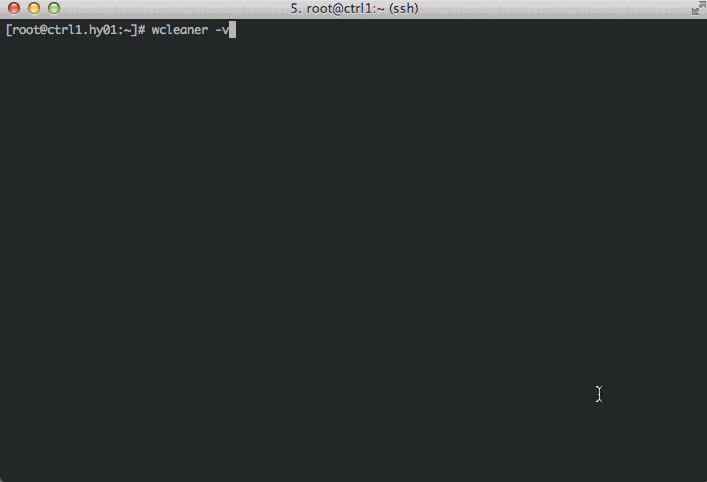

# Wcleaner - Disk Space Cleaner

## Features
* Automatic identification log files. Default log pattern is r'.\*\blogs?\b.\*'.
* Intelligently unify similar log files by numeric patterns. Very useful for log rotation.
* Automatic find deleted files which is not free up space.
* Automatic clean log files when enable junk center.
* Junk center support greylist, whitelist, blacklist, redlist.

## Demo


## Install
````bash
$ pip install wcleaner
````

## Usage
````
usage: wcleaner [-h] [-v] [-n N] [--max-capacity MAX_CAPACITY]
                [--target-capacity TARGET_CAPACITY] [--auto] [--no-interface]
                [FILESYSTEM]

Disk Space Cleaner

positional arguments:
  FILESYSTEM            filesystem to clean

optional arguments:
  -h, --help            show this help message and exit
  -v, --version         show program's version number and exit
  -n N                  print the largest N files
  --max-capacity MAX_CAPACITY
                        max capacity. default: 90
  --target-capacity TARGET_CAPACITY
                        target capacity. default: 50
  --auto                automatically clean junk files in whitelist, greylist and on matched hostname
  --no-interface        none-interactive mode
````

## Enable Junk Center
````bash
$ echo_wcleaner_conf > /etc/wcleaner.conf
$ sed -i 's/your redis host/$host/g' /etc/wcleaner.conf
$ sed -i 's/6379/$port/g' /etc/wcleaner.conf
````

## Junk Center
Suport grey/white/black/red list

```python
list: [
    junk1: set([
        hostname1,
        hostname2,
    ]),
    junk2: set([
        hostname1,
        hostname2,
    ]),
]
```

* greylist:  [--auto] Junk will be automatic cleaned if hostname marched in greylist. Wcleaner clean up junk and submit it to here. #safe or normal
* whitelist: [--auto] Junk will be automatic cleaned if it is in whitelist. #safe
* blacklist: All junks in blacklist can not be automatic cleaned up. #normal
* redlist:  All junks in redlist can not be cleaned up. #dangerous
